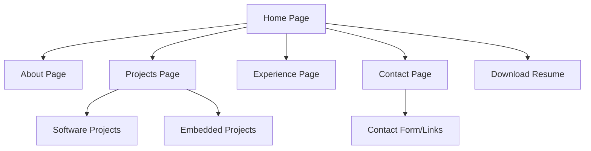

## 1. Product Overview
A simple, lightweight personal portfolio website showcasing expertise in both Embedded Systems and Software Engineering. The site provides a clean, professional presentation of projects, skills, and experience with easy access to downloadable resumes.

Target audience: Potential employers, collaborators, and professional contacts seeking to understand the candidate's technical capabilities across embedded systems and software development domains.

## 2. Core Features

### 2.1 User Roles
This is a public portfolio website with no user authentication required. All visitors have read-only access to view portfolio content and download resumes.

### 2.2 Feature Module
The portfolio consists of the following main pages:
1. **Home page**: Hero section with introduction, navigation menu, and professional summary.
2. **About page**: Detailed background, skills overview, and education information.
3. **Projects page**: Categorized project showcase with Software and Embedded Systems sections.
4. **Experience page**: Work history and professional experience timeline.
5. **Contact page**: Contact information and professional links.

### 2.3 Page Details
| Page Name | Module Name | Feature description |
|-----------|-------------|---------------------|
| Home page | Hero section | Display professional headline, brief introduction, and call-to-action buttons for resume downloads. |
| Home page | Navigation | Sticky navigation bar with smooth scrolling to sections and active section highlighting. |
| Home page | Quick links | Social media and professional profile links (LinkedIn, GitHub, etc.). |
| About page | Skills overview | Categorized display of technical skills with proficiency levels for both Software and Embedded domains. |
| About page | Education | Academic background and certifications information. |
| About page | Technologies | Grid display of programming languages, tools, and frameworks. |
| Projects page | Project categories | Tab-based filtering between Software and Embedded Systems projects. |
| Projects page | Project cards | Individual project displays with title, description, technologies used, and links to code/demo. |
| Projects page | Project details | Expandable view for project screenshots, detailed descriptions, and technical challenges. |
| Experience page | Timeline | Chronological display of work experience with company names, roles, and duration. |
| Experience page | Role details | Description of responsibilities and achievements for each position. |
| Contact page | Contact form | Simple form for visitors to send messages (optional, can be email link). |
| Contact page | Professional links | Direct links to email, LinkedIn, GitHub, and other professional profiles. |
| Global | Resume download | Prominent buttons to download both Software and Embedded Systems resumes in PDF format. |
| Global | Responsive design | Mobile-friendly layout that adapts to different screen sizes. |

## 3. Core Process
The portfolio follows a simple navigation flow where visitors can:
1. Land on the Home page and get an immediate overview of the candidate's professional profile
2. Navigate to specific sections using the top navigation menu
3. Browse through categorized projects in either Software or Embedded Systems
4. Review detailed experience and education background
5. Download relevant resumes or make contact through provided channels

## 4. User Interface Design

### 4.1 Design Style
- **Primary colors**: Deep blue (#1e40af) for headers and accents, white (#ffffff) for backgrounds
- **Secondary colors**: Light gray (#f8fafc) for section backgrounds, dark gray (#374151) for text
- **Button style**: Rounded corners (8px radius), subtle shadows on hover, clear call-to-action colors
- **Typography**: Clean sans-serif font (Inter or system fonts), 16px base size, proper hierarchy with h1-h6
- **Layout style**: Single-page design with smooth scrolling sections, card-based project displays
- **Icons**: Minimalist line icons from Lucide React or Heroicons for consistency

### 4.2 Page Design Overview
| Page Name | Module Name | UI Elements |
|-----------|-------------|-------------|
| Home page | Hero section | Full-width hero with gradient overlay, large professional headline, brief bio text, dual resume download buttons prominently displayed. |
| Navigation | Header | Sticky transparent header that becomes opaque on scroll, smooth hover effects, active section indicator with underline animation. |
| Projects page | Project cards | Responsive grid layout (3 columns desktop, 1 column mobile), hover effects with elevation, technology tag pills, external link icons. |
| About page | Skills section | Progress bars or skill pills showing proficiency levels, two-column layout for Software vs Embedded skills. |
| Experience page | Timeline | Vertical timeline with company logos, date ranges, and expandable detail cards with smooth animations. |
| Contact page | Contact form | Clean input fields with focus states, textarea for message, submit button with loading state (if form is implemented). |

### 4.3 Responsiveness
Desktop-first design approach with mobile optimization:
- Breakpoints: 640px (mobile), 768px (tablet), 1024px (desktop)
- Touch-friendly navigation and buttons on mobile devices
- Optimized typography scaling for readability on all devices
- Horizontal scrolling prevention on mobile devices

### 4.4 Performance Considerations
- Lightweight implementation with minimal dependencies
- Optimized images with lazy loading for project screenshots
- CSS animations using transform and opacity for smooth performance
- Preload critical fonts and resources