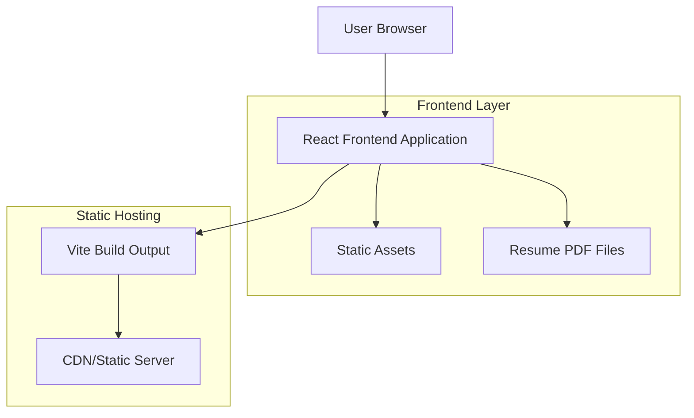
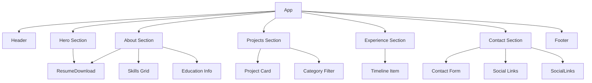

## 1. Architecture Design



## 2. Technology Description

- **Frontend**: React@18 + Tailwind CSS@3 + Vite
- **Initialization Tool**: vite-init
- **Backend**: None (Static Site)
- **Styling**: Tailwind CSS for utility-first styling
- **Icons**: Lucide React for consistent iconography
- **Animations**: Framer Motion for smooth transitions (optional, lightweight)
- **PDF Handling**: Static file serving for resume downloads

## 3. Route Definitions

| Route | Purpose |
|-------|---------|
| / | Home page with hero section and navigation |
| /#about | About section with skills and education |
| /#projects | Projects showcase with category filtering |
| /#experience | Professional experience timeline |
| /#contact | Contact information and links |
| /resume/software.pdf | Software Engineering resume download |
| /resume/embedded.pdf | Embedded Systems resume download |

## 4. Project Structure

```
src/
├── components/
│   ├── layout/
│   │   ├── Header.jsx
│   │   ├── Footer.jsx
│   │   └── Navigation.jsx
│   ├── sections/
│   │   ├── Hero.jsx
│   │   ├── About.jsx
│   │   ├── Projects.jsx
│   │   ├── Experience.jsx
│   │   └── Contact.jsx
│   ├── ui/
│   │   ├── Button.jsx
│   │   ├── Card.jsx
│   │   └── Timeline.jsx
│   └── common/
│       ├── ResumeDownload.jsx
│       └── SocialLinks.jsx
├── data/
│   ├── projects.js
│   ├── experience.js
│   └── skills.js
├── styles/
│   └── globals.css
├── assets/
│   ├── images/
│   └── resume/
│       ├── software.pdf
│       └── embedded.pdf
├── App.jsx
└── main.jsx
```

## 5. Component Architecture



## 6. Data Models

### 6.1 Static Data Structure

```javascript
// projects.js
export const projects = [
  {
    id: 1,
    title: "Project Name",
    category: "software" | "embedded",
    description: "Brief project description",
    technologies: ["React", "Node.js", "C++"],
    image: "/images/project1.jpg",
    github: "https://github.com/username/project",
    demo: "https://demo-link.com",
    featured: true
  }
];

// experience.js
export const experience = [
  {
    id: 1,
    company: "Company Name",
    role: "Job Title",
    duration: "2023 - Present",
    type: "software" | "embedded",
    description: "Role responsibilities and achievements",
    technologies: ["Python", "AWS", "Microcontrollers"]
  }
];

// skills.js
export const skills = {
  software: [
    { name: "React", level: 90 },
    { name: "Python", level: 85 },
    { name: "JavaScript", level: 95 }
  ],
  embedded: [
    { name: "C/C++", level: 90 },
    { name: "ARM Cortex", level: 80 },
    { name: "RTOS", level: 75 }
  ]
};
```

## 7. Build Configuration

### 7.1 Vite Configuration
```javascript
// vite.config.js
import { defineConfig } from 'vite'
import react from '@vitejs/plugin-react'

export default defineConfig({
  plugins: [react()],
  base: './',
  build: {
    outDir: 'dist',
    assetsDir: 'assets',
    sourcemap: true,
    rollupOptions: {
      output: {
        manualChunks: {
          vendor: ['react', 'react-dom'],
          ui: ['lucide-react']
        }
      }
    }
  }
})
```

### 7.2 Tailwind Configuration
```javascript
// tailwind.config.js
export default {
  content: [
    "./index.html",
    "./src/**/*.{js,ts,jsx,tsx}",
  ],
  theme: {
    extend: {
      colors: {
        primary: '#1e40af',
        secondary: '#f8fafc',
        accent: '#374151'
      },
      fontFamily: {
        sans: ['Inter', 'system-ui', 'sans-serif']
      }
    },
  },
  plugins: [],
}
```

## 8. Deployment Strategy

### 8.1 Static Hosting Options
- **Netlify**: Drag-and-drop deployment with form handling
- **Vercel**: Git-based deployment with preview deployments
- **GitHub Pages**: Direct integration with GitHub repository
- **Firebase Hosting**: Google's CDN with custom domain support

### 8.2 Build Process
```bash
# Development
npm run dev

# Production build
npm run build

# Preview production build
npm run preview
```

## 9. Performance Optimization

### 9.1 Code Splitting
- Route-based code splitting for sections
- Component-level lazy loading for heavy components
- Image optimization with WebP format support

### 9.2 Asset Optimization
- Minified CSS and JavaScript
- Optimized images with responsive sizing
- Preload critical resources
- Implement service worker for offline capability (optional)

### 9.3 Core Web Vitals Targets
- **LCP (Largest Contentful Paint)**: < 2.5s
- **FID (First Input Delay)**: < 100ms
- **CLS (Cumulative Layout Shift)**: < 0.1